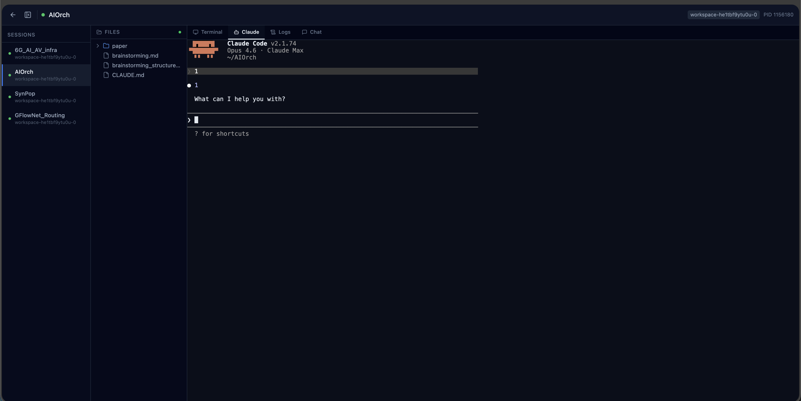

# AgentHQ — AI Session Orchestrator

A web-based dashboard for managing Claude Code sessions across multiple machines. Create, monitor, and interact with Claude Code instances running on different servers from a single unified interface.



## Why AgentHQ?

Running Claude Code across multiple machines (dev laptops, GPU servers, cloud VMs) means juggling SSH sessions and losing track of what's running where. AgentHQ gives you:

- **One dashboard** to see all Claude Code sessions across all machines
- **Web terminal** to interact with any session from your browser
- **Start/Stop/Restart** controls — spin up Claude Code on any machine with one click
- **File browser** to view project files alongside the terminal
- **Project suggestions** pulled from `~/.claude/projects/` history

## Architecture

```
  Browser (React + xterm.js)
         │
    REST + WebSocket
         │
  ┌──────┴──────┐
  │  FastAPI     │   ← Docker (nginx + uvicorn)
  │  + SQLite    │
  └──────┬──────┘
         │
    ┌────┼────┬────────┐
    │    │    │        │
  Agent Agent Agent  Agent
  (WSL) (GPU) (Cloud) (Dev)
```

Each **agent** runs on a machine, heartbeats to the server, and manages tmux sessions running Claude Code. The **server** stores state in SQLite and relays WebSocket connections between the browser and agents. The **frontend** is a React SPA with an embedded terminal (xterm.js).

## Quick Start

### 1. Deploy the Server

#### Option A: Self-Hosted (Docker Compose)

Best for lab servers, on-prem machines, or any box you control.

```bash
git clone git@github.com:UMN-Choi-Lab/AgentHQ.git && cd AgentHQ
cp env.example .env
# Edit .env: set AGENTHQ_TOKEN to a strong secret

docker compose up -d --build
# Access at http://<your-server>:8420
```

#### Option B: Fly.io

Good for a persistent, publicly accessible server with minimal setup. Free tier includes 3 shared VMs and 1 GB persistent volume.

```bash
# Install flyctl: https://fly.io/docs/hands-on/install-flyctl/
fly auth login

# Clone and launch
git clone git@github.com:UMN-Choi-Lab/AgentHQ.git && cd AgentHQ
fly launch --no-deploy          # creates fly.toml — pick a region near you

# Set your auth token
fly secrets set AGENTHQ_TOKEN="your-strong-secret"

# Create a persistent volume for SQLite
fly volumes create agenthq_data --size 1 --region <your-region>

# Deploy
fly deploy

# Access at https://<your-app>.fly.dev
```

Add to your `fly.toml`:
```toml
[mounts]
  source = "agenthq_data"
  destination = "/app/data"

[env]
  AGENTHQ_DB_PATH = "/app/data/agenthq.db"
```

#### Option C: Railway / Render

Both support Docker-based deploys with persistent storage:

- **[Railway](https://railway.app)** — Connect your GitHub repo, add `AGENTHQ_TOKEN` as an env variable, and deploy. Attach a volume for SQLite persistence.
- **[Render](https://render.com)** — Create a Web Service from Docker, set environment variables, and add a persistent disk mounted at `/app/data`.

> **Note:** AgentHQ uses SQLite, so the server needs a persistent filesystem. Serverless platforms (Vercel, AWS Lambda) won't work without switching to PostgreSQL.

### 2. Run an Agent on Each Machine

```bash
pip install aiohttp pyyaml
cd agent
cp config.yaml.example config.yaml
```

Edit `config.yaml`:

```yaml
server_url: "http://<your-server>:8420"
token: "your-token-here"        # must match AGENTHQ_TOKEN
machine_name: "my-gpu-server"   # human-readable name
```

Run the agent:

```bash
# Linux/macOS — managed background process with auto-restart
cd agent
./run.sh start        # start agent in background
./run.sh status       # check if running (PID, uptime)
./run.sh log          # tail the log file
./run.sh stop         # graceful shutdown
./run.sh restart      # stop + start
```

```powershell
# Windows (PowerShell)
cd agent
.\run.ps1 start       # start agent in background
.\run.ps1 status      # check if running (PID, CPU, memory)
.\run.ps1 stop         # stop agent
```

Or run directly in the foreground:

```bash
python -m agenthq_agent --config config.yaml
```

The agent will appear in the dashboard within 10 seconds.

### 3. Create a Session

Click the **+** button in the dashboard, select a machine, pick a project from the suggestions (populated from `~/.claude/projects/` history), and click **Create**. This spawns a tmux session running `claude --dangerously-skip-permissions` on the selected machine.

## Features

### Session Management
- **Create** sessions on any connected machine via the web UI
- **Start/Stop/Restart** — control session lifecycle from the header bar
- **Auto-discovery** of project history from `~/.claude/projects/`
- **Persistent sessions** — managed sessions survive agent restarts (stored in `managed_sessions.json`)

### Web Terminal
- Full interactive terminal via xterm.js + PTY
- Connects to tmux sessions on remote machines
- Auto-resizing to fit the browser window

### File Browser
- Browse project files in the sidebar
- View file contents alongside the terminal
- Real-time file tree updates via WebSocket

### Multi-Machine Support
- Sessions grouped by machine in the sidebar
- WSL agents auto-detect Windows-side `~/.claude/projects/`
- Path decoding handles both Linux (`-home-user-project`) and Windows (`C--Users-user-project`) Claude project encodings

### Dashboard
- Session list with status indicators (running/stopped/offline)
- Filter by machine or status
- Dark theme, responsive layout
- Bearer token authentication

## Configuration

### Server Environment Variables

| Variable | Default | Description |
|----------|---------|-------------|
| `AGENTHQ_TOKEN` | (required) | Shared auth token for agents and the web UI |
| `AGENTHQ_PORT` | `8420` | Port exposed by Docker |
| `AGENTHQ_DB_PATH` | `agenthq.db` | SQLite database path |

### Agent Configuration (`config.yaml`)

| Key | Default | Description |
|-----|---------|-------------|
| `server_url` | `http://localhost:8420` | AgentHQ server URL |
| `token` | (required) | Must match `AGENTHQ_TOKEN` |
| `machine_name` | hostname | Human-readable machine name |
| `heartbeat_interval` | `10` | Seconds between heartbeats |
| `sync_enabled` | `true` | Sync `.claude/` folder to server |
| `extra_sessions` | `[]` | Manually registered sessions |
| `extra_project_dirs` | `[]` | Additional `.claude/projects/` dirs to scan |

### Extra Sessions (Config-Based)

For sessions that aren't created through the UI, add them to `config.yaml`:

```yaml
extra_sessions:
  - name: "my-project"
    path: "/home/user/projects/my-project"
```

## Directory Structure

```
server/              FastAPI backend
  routers/           REST + WebSocket endpoints
  store.py           SQLite data layer
  ws_manager.py      WebSocket connection manager
  auth.py            Bearer token auth
  models.py          Pydantic models

agent/               Lightweight Python agent
  agenthq_agent/
    core.py          All agent logic (discovery, heartbeat, terminals, files)
    cli.py           CLI entrypoint

frontend/            React + TypeScript + Vite
  src/
    pages/           Dashboard + SessionDetail
    components/      TerminalView, FileTree, NewSessionModal, etc.
    hooks/           useWebSocket, useTerminalWebSocket

docker/              Dockerfiles + nginx config
docker-compose.yml
```

## Tech Stack

- **Backend:** Python 3.10+, FastAPI, aiosqlite, uvicorn
- **Frontend:** React 18, TypeScript, Vite, TailwindCSS v4, xterm.js
- **Agent:** Python 3.10+, aiohttp, asyncio, tmux
- **Deploy:** Docker Compose, nginx reverse proxy

## How It Works

1. **Agent heartbeat** — Each agent POSTs to `/api/agents/heartbeat` every 10 seconds with its session list and known projects. The server stores this in SQLite and returns any pending commands.

2. **Session creation** — When you click Create in the UI, the server queues a `create_session` command. The agent picks it up on the next heartbeat and spawns a tmux session running Claude Code.

3. **Terminal streaming** — The agent opens a PTY, attaches to the tmux session, and connects via WebSocket to the server. The server relays data between the agent's PTY and the browser's xterm.js. All data is base64-encoded JSON over WebSocket.

4. **File browsing** — The agent connects a files WebSocket per session. When the browser requests a directory listing or file content, the server forwards the request to the agent, which reads from disk and responds.

5. **Session lifecycle** — Stop kills the tmux session and removes it from the agent's managed list. Start/Restart creates a new tmux session. The agent persists managed sessions to `managed_sessions.json` so they survive restarts.

## License

MIT
